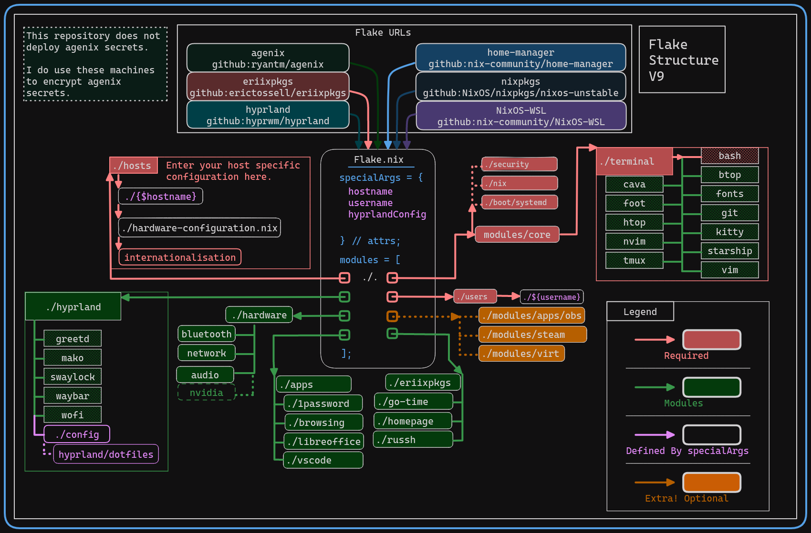

> :warning: **I am not an authority on `Nix` or `NixOS`. I am merely an apprentice, an *Alice* navigating through *Wonderland*. At least, for now.**

Anyway, here are my dotfiles. I hope you like them!

# Niklas's Nixflakes

## Flake Structure

The modules are grouped to be ***almost*** purely *functional*. As a result, you will often find both the system configuration and the home-manager configuration in the same place. Not all NixOS users follow this paradigm.

This repository has become more opinionated over time and now requires passing down variables from `flake.nix` to fetch the appropriate `host` and `user` specific configurations for a given device.

📊 Diagrams

  
*Disclaimer: This image is from [erictossell](https://github.com/erictossell), and the overall project is heavily inspired by his config, so check it out too!*

